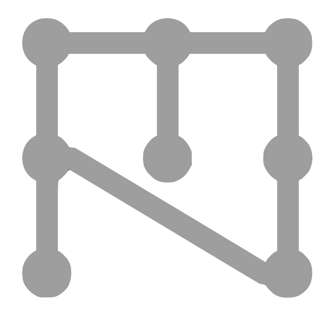

``ezmsg``
===================================

Messaging and Multiprocessing.

``ezmsg`` is a pure-python implementation of a directed acyclic graph (DAG) pub/sub messaging pattern based on LabGraph which is optimized and intended for use in constructing real-time neural signal processing implementations. ``ezmsg`` implements much of the LabGraph API (with a few notable differences), and owes a lot of its design to the LabGraph developers/project. Afterall, imitation is the sincerest form of flattery.

The ``ezmsg`` library eases the creation of modular systems whose elements can be switched out easily. Consider the use case of building a processing pipeline where you will be experimenting with adding and removing steps until you find an optimal workflow. ``ezmsg`` allows you to easily separate each step into a discrete entity and piece together a workflow from those entities. Check out the `Examples <https://github.com/iscoe/ezmsg/tree/master/examples>`_ to see how this works.

Why use ``ezmsg`` over a comparable tool? ``ezmsg`` is extremely fast and uses Python's (currently) new multiprocessing.shared_memory module to facilitate efficient message passing without C++ or any compilation/build tooling. It is easy to install and contains less boilerplate than similar frameworks. It also provides a framework for building processing pipelines while keeping best practices in mind.

Check out this `Google Colab <https://colab.research.google.com/drive/1gHspPyS-lIUpb9zKFzgmBqAZcUPCINSh?usp=sharing>`_ for an example ``ezmsg`` notebook to experiment with.

Contents
--------

.. toctree::
   :maxdepth: 1

   getting-started
   about
   api
   utils
   other
   extensions
   developer
