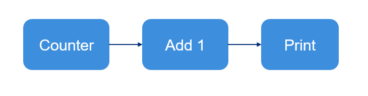
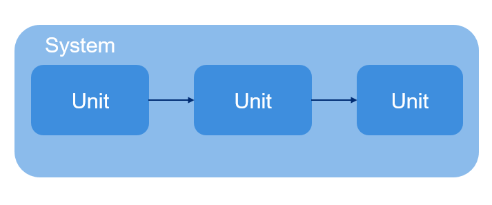

Your First ezmsg Pipeline
##############################

If this is your first time using ezmsg, you're in the right place. This notebook will walk you through the basics of creating a very simple ezmsg system.

ezmsg is ideal for creating modular processing pipelines whose steps can be arranged as a directed acyclic graph. In this notebook, we will walk through a very simple graph which generates a count of numbers, adds 1 to each number, and prints to standard output.

|tutorial_pipeline|

In ezmsg syntax, this graph would look like this:

|tutorial_system|

We will write an ezmsg Unit for each discrete step of our pipeline, and connect them together in a Collection. 

First, ensure you have ezmsg installed. Please consult :doc:`start` for installation instructions. 

.. note:: If you are using a Jupyter notebook, you can install ezmsg directly from the notebook using the following command:

   .. code-block:: bash

      !pip install ezmsg

Next, ensure we have all the necessary imports:

.. code-block:: python

    import ezmsg.core as ez
    from dataclasses import dataclass
    from typing import AsyncGenerator

Building a basic unit
****************************

Create a message type to pass between the Units. Python dataclasses are great for arbitrary messages, but you can use any type.

.. code-block:: python
    
    @dataclass
    class CountMessage:
        value: int

We also need a way to tell the Unit how many numbers to generate. All classes that derive from ez.Settings are frozen dataclasses!

.. code-block:: python
    
    class CountSettings(ez.Settings):
        iterations: int

Next, create a Unit that will generate the count. Every Unit represents a node in the directed acyclic graph and should contain inputs and/or outputs and at least one function which subscribes to the inputs or publishes to the outputs.

For Count, we create an OutputStream and a publishing function which will perform the number calculation and yield CountMessages to the OutputStream.

.. code-block:: python
    
    class Count(ez.Unit):
        # Only provide a settings type, do not instantiate
        # The Unit should receive settings from the System that uses it
        # SETTINGS is a special/reserved class attribute for ez.Unit
        SETTINGS = CountSettings

        OUTPUT_COUNT = ez.OutputStream(CountMessage)

        @ez.publisher(OUTPUT_COUNT)
        async def count(self) -> AsyncGenerator:
            count = 0
            while count < self.SETTINGS.iterations:
                yield (self.OUTPUT_COUNT, CountMessage(
                    value=count
                ))
                count = count + 1
            
            raise ez.NormalTermination

Building a unit with multiple streams
**************************************
The next Unit in the chain should accept a CountMessage from the first Unit, add 1 to its value, and yield a new CountMessage. To do this, we create a new Unit which contains a function which both subscribes and publishes. We will connect this Unit to Count later on, when we create a System.

The subscribing function will be called anytime the Unit receives a message to the InputStream that the function subscribes to. In this case, INPUT_COUNT.

.. code-block:: python
    
    class AddOne(ez.Unit):

        INPUT_COUNT = ez.InputStream(CountMessage)
        OUTPUT_PLUS_ONE = ez.OutputStream(CountMessage)

        @ez.subscriber(INPUT_COUNT)
        @ez.publisher(OUTPUT_PLUS_ONE)
        async def on_message(self, message) -> AsyncGenerator:
            yield (self.OUTPUT_PLUS_ONE, CountMessage(
                value=message.value + 1
            ))

Another unit
*************
Finally, the last unit should print the value of any messages it receives.

.. code-block:: python
    
    class PrintValue(ez.Unit):

        INPUT = ez.InputStream(CountMessage)

        @ez.subscriber(INPUT)
        async def on_message(self, message) -> None:
            print(message.value)

Combining multiple units into a collection
*******************************************
We can optionally combine the units into a single node called a Collection. The configure() and network() functions are special functions that define Collection behavior.

.. code-block:: python
    
    class CountCollection(ez.Collection):

        # Define member units
        COUNT = Count()
        ADD_ONE = AddOne()
        PRINT = PrintValue()

        # Use the configure function to apply settings to member Units
        def configure(self) -> None:
            self.COUNT.apply_settings(
                CountSettings(iterations=20)
            )

        # Use the network function to connect inputs and outputs of Units
        def network(self) -> ez.NetworkDefinition:
            return (
                (self.COUNT.OUTPUT_COUNT, self.ADD_ONE.INPUT_COUNT),
                (self.ADD_ONE.OUTPUT_PLUS_ONE, self.PRINT.INPUT)
            )

Creating a pipeline
**************************************

Finally, instantiate and run the system!
One can do this with just the units we built above, or we can include the collection. 

Using Units only
===============================

.. code-block:: python
    
    collection = CountCollection()
    ez.run(collection)

Using a Collection and units
===============================

.. code-block:: python
    
    collection = CountCollection()
    ez.run(collection)

How to run the pipeline?
*****************************

